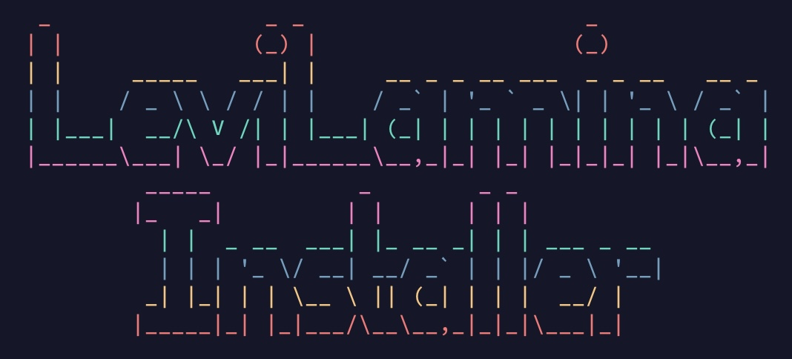

## LeviLamina Installer


[](https://github.com/YzevDev/LeviLaminaInstaller/stargazers)
[](https://github.com/YzevDev/LeviLaminaInstaller/releases/latest)
[](LICENSE)

一个简单高效的LeviLamina自动安装脚本，专门为Debian/Ubuntu而设计。

### ✨ 功能亮点

- ✈️ 一键自动安装LeviLamina及所有依赖项
- 🔍 自动识别系统版本并适配最佳安装方案
- 💻 支持多个Debian/Ubuntu版本
- 📦 简洁高效的安装流程

### 🚀 使用方法

下载安装脚本

```bash
curl -fsSL https://raw.githubusercontent.com/YzevDev/LeviLaminaInstaller/main/scripts/install.sh | sudo bash
```

### 🛠️ 系统要求

- 操作系统
  - Debian 11
  - Debian 12
  - Debian Testing
  - Ubuntu 20.04
  - Ubuntu 22.04
  - Ubuntu 24.04
  - Ubuntu 24.10
  - Ubuntu 25.04
- 系统架构
  - x86_64

### 📬 联系方式

通过 GitHub：[我的个人资料](https://github.com/YzevDev)

### 📜 许可证

本项目采用MIT许可证，详情请参阅[LICENSE](LICENSE)文件。
